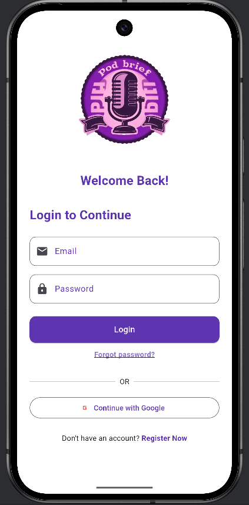

# PodBrief

**PodBrief** is a podcast summary tool designed to save users time by summarizing podcast transcripts with the help of AI. It allows users to paste long podcast transcripts, and the app generates concise summaries. The app integrates with **Ollama** for enhanced summaries using the **Llama 3.2** model, providing an AI-powered solution for podcast listeners who want to stay informed but don't have time to listen to every episode.

---

## Features

* **AI-powered Podcast Summaries**: Automatically generates summaries of podcast transcripts.
* **Offline Mode**: Basic AI model works even when **Ollama** or **Llama 3.2** is unavailable.
* **User Authentication**: Sign in anonymously with Firebase Authentication.
* **Firestore Integration**: Saves and stores summary data.
* **Smooth UI**: Custom-built Flutter UI with clean design and easy navigation.

---

## Installation

To run PodBrief locally, follow the steps below.

### 1. Clone the repository

```bash
git clone https://github.com/YayaBardweel/podbrief.git
cd podbrief
```

### 2. Install dependencies

Make sure you have **Flutter** installed on your machine. If you don't have it, follow [this guide](https://flutter.dev/docs/get-started/install) to install it.

```bash
flutter pub get
```

### 3. Set up Firebase for your project

You need to set up Firebase for your project to handle authentication and Firestore.

1. Go to [Firebase Console](https://console.firebase.google.com/).
2. Create a new project or use an existing one.
3. Set up Firebase Authentication and Firestore.
4. Add the **google-services.json** or **GoogleService-Info.plist** to your project directory.

### 4. Start the application

Once dependencies are installed and Firebase is set up:

```bash
flutter run
```

---

## Usage

1. **Sign in or use the app anonymously**: The app allows users to use it with anonymous authentication.
2. **Paste your transcript**: Copy-paste any podcast transcript into the provided text field.
3. **Create Summary**: Once the transcript is added, click **Create Summary** to generate a concise summary.
4. **View the summary**: After the summary is created, it is displayed with key details, including the date, word count, and a preview of the content.

---

## API Integration

PodBrief uses the **Ollama** API with **Llama 3.2** to generate advanced summaries. Here’s how the integration works:

* **Local API**: `http://localhost:11434`
* **Model Used**: `llama3.2`

## Screenshots

### Login Screen


### Home Screen with Summaries


### History Screen


### Create a Podcast Summary Screen


### Profile Screen


---

## Contributing

We welcome contributions! If you'd like to contribute to **PodBrief**, follow these steps:

1. Fork the repository.
2. Create your feature branch (`git checkout -b feature/your-feature`).
3. Commit your changes (`git commit -m 'Add new feature'`).
4. Push to the branch (`git push origin feature/your-feature`).
5. Open a pull request.

---

